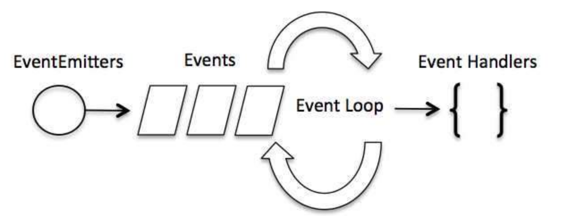
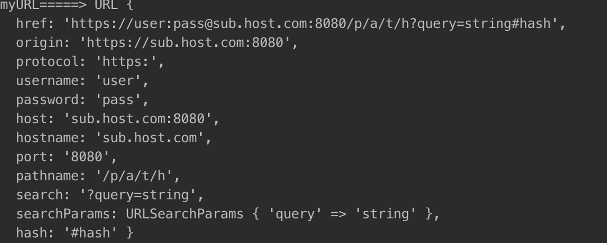

# node-primer
some basic concept and practice of node, review now!

## Table of Contents

- [Architecture for simple node applications](#arch-simple-node-app)
- [Event loop and EventEmitter](#event-loop-event-emitter)
- [Buffer](#buffer)
- [Stream](#stream)
- [Module system](#module-system)
- [About router](#router)
- [File system](#file-system)
- [Global](#global)
- [Url](#url)
- [Http](#http)
- [Request](#request)
- [NetWork](#network)
- [OS](#os)
- [Path](#path)
- [Util](#util)

## Architecture for simple node applications

1 about node

node本质是运行时环境(runtime)和库的集合；

> **Note**: js最早只能运行在浏览器端，然而浏览器只是给js提供一个上下文执行环境，这个执行环境定义js可以完成什么工作。
然而，js本身是一门完整的语言，其能力相对于其它语言有过之而无不及。nodejs的出现实际上是定义了另一种上下文，使它能够在后端运行。 
因此nodejs的本质是一个运行时环境，使得js能够在服务器端解释执行，同时也是一个js库,里面封装了一些常用的功能。


2 a architecture of simple node app

(1) node应用的不同模块

    任何应用都有一个入口文件，但把所有的代码放在一个文件中并不是一个好的实践，通常为了保持代码的可读性，可扩展性，我们会进行代码分离，将不同的功能的代码放在不同的模块中;

(2) http服务器--server.js提供web页面；

```javascript

function start(route, handle, port) {//高阶函数
    function onRequest(request, response) {//回调函数

        var postData = "";
        var pathname = url.parse(request.url).pathname;
        request.addListener("data", function (dataChunk) {
            postData = postData + dataChunk;
            console.log("postdata received!");
        });
        request.addListener("end", function () {
            //路由，根据请求的路径和方法，调用不同的请求处理函数；
            route(handle, pathname, response, request);
            console.log("postdata received finish!");
        });
    }
    if(typeof port !== "number"){
        port = 8081;
    }
    http.createServer(onRequest).listen(port);//闭包
    console.log("Server has started at port: " + port);
}
exports.start = start;

```

> **Note**: 无论何时当服务器收到一个请求，onRequest回调函数就会被调用来处理请求。nodejs是基于事件驱动的，任何时候有相应事件发生的时调用这个回调函数。

(3) 路由--routes.js

    根据请求路径不同调用不同的请求处理程序；router(handle, pathname, response);
    
```javascript
function route(handle, pathname, response, request) {
    console.log("about a route request for"+ pathname);
    if(typeof handle[pathname] === "function"){
        handle[pathname](response, request);
    }else {
        console.log("No request handle found for" + pathname);
        response.writeHead(404, {"Content-Type": "text/plain"});
        response.write("404 Not Found");
        response.end();
    }
}

exports.route = route;
```

(4) 请求处理程序--requestHandler.js

    对请求作出响应；请求处理程序中不要进行耗时的阻塞操作，对于阻塞操作，通过回调的方式来执行；handle(response);

```javascript
function start(response, request) {
    console.log("Request handler 'start' was called.");
    var body = '<html>'+
        '<head>'+
        '<meta http-equiv="Content-Type" '+
        'content="text/html; charset=UTF-8" />'+
        '</head>'+
        '<body>'+
        '<form action="/upload" enctype="multipart/form-data" '+
        'method="post">'+
        '<input type="file" name="upload">'+
        '<input type="submit" value="Upload file" />'+
        '</form>'+
        '</body>'+
        '</html>';
    response.writeHead(200, {"Content-Type": "text/html"});
    response.write(body);
    response.end();
}
exports.handler = {
    "/": start,
    "/start": start
}
```
(5) 视图--views.js

    对不同的请求作出响应的时候，大部分情况下，需要把内容展示出来，此时请求处理程序可能需要调用视图来生成对应的展示；


```bash
    .
    ├─- README.md
    ├── index.js 入口文件
    ├── server.js 基础服务器文件
    └── router.js 路由模块文件
    |__ viwes 视图模块
    |__ requestHandler 请求处理模块
```
> **Note**: 划分模块的时候，尽量保证模块中高内聚，模块间松耦合；提高模块的可复用性，以及整个项目的可读性和可维护性；
nodejs是单线程的，它通过事件循环来实现并行操作；

<sup>[(back to table of contents)](#arch-simple-node-app)</sup>


## Event loop and EventEmitter

1. 事件循环
    Node.js 的每一个 API 都是异步的，并作为一个独立线程运行，使用异步函数调用，并处理并发。js 基本上所有的事件机制都是用设计模式中观察者模式实现。
   


```javascript
    // 引入 events 模块
    var events = require('events');
    // 创建 eventEmitter 对象
    var eventEmitter = new events.EventEmitter();
    
    // 创建事件处理程序
    var connectHandler = function connected() {
       console.log('连接成功。');
       // 触发 data_received 事件 
       eventEmitter.emit('data_received');
    }
    
    // 绑定 connection 事件处理程序
    eventEmitter.on('connection', connectHandler);
     
    // 使用匿名函数绑定 data_received 事件
    eventEmitter.on('data_received', function(){
       console.log('数据接收成功。');
    });
    
    // 触发 connection 事件 
    eventEmitter.emit('connection');
    console.log("程序执行完毕。");
```

2. about EventEmitter
    
    Node.js 所有的异步 I/O 操作在完成时都会发送一个事件到事件队列。Node.js里面的许多对象都会分发事件：一个net.Server对象会在每次有新连接时分发一个事件， 
    一个fs.readStream对象会在文件被打开的时候发出一个事件。 所有这些产生事件的对象都是 events.EventEmitter 的实例。

<table>
        <tr>
            <th>EventEmitter的api</th>
            <th>api的释义</th>
        </tr>
        <tr>
            <th>addListener(event, listener)</th>
            <th>为指定事件添加一个监听器到监听器数组的尾部。</th>
        </tr>
        <tr>
            <th>on(event, listener)</th>
            <th>on为addListener的别名，功能一样。</th>
        </tr>
        <tr>
            <th>once(event, listener)</th>
            <th>为指定事件注册一个单次监听器，即监听器最多只会触发一次；</th>
        </tr>
        <tr>
            <th>removeListener(event, listener)</th>
            <th>移除指定事件的某个监听器</th>
        </tr>
        <tr>
            <th>removeAllListeners([event])</th>
            <th>移除指定事件的所有监听器</th>
        </tr>
        <tr>
            <th>setMaxListeners(n)</th>
            <th>默认情况下，添加的监听器超过10个就会输出警告信息。 setMaxListeners用于提高监听器的默认数量限制。</th>
        </tr>
        <tr>
            <th>listeners(event)</th>
            <th>返回指定事件的监听器数组</th>
        </tr>
        <tr>
            <th>emit(event, [arg1], [arg2], [...])</th>
            <th>触发事件</th>
        </tr>
    </table>
    
 3. error事件
 
    EventEmitter 定义了一个特殊的事件 error，它包含了错误的语义，我们在遇到 异常的时候通常会触发 error 事件。当 error 被触发时，EventEmitter 规定如果没有响 应的监听器，Node.js 会把它当作异常，退出程序并输出错误信息。我们一般要为会触发 error 事件的对象设置监听器，避免遇到错误后整个程序崩溃。
    
<sup>[(back to table of contents)](#event-loop-event-emitter)</sup>

## Buffer

1. about buffer

    JavaScript语言自身只有字符串数据类型，没有二进制数据类型。但在处理像TCP流或文件流时，必须使用到二进制数据。因此在 Node.js核心库中，定义了一个Buffer类，该类用来创建一个专门存放二进制数据的缓存区。
Buffer 实例一般用于表示编码字符的序列；通过使用显式的字符编码，就可以在 Buffer 实例与普通的 JavaScript 字符串之间进行相互转换。

```javascript
    const { Buffer } = require('buffer');
    
    //创建Buffer类
    let buf = Buffer.from('runoob');
    
    //写入缓冲区,返回实际写入的大小。如果 buffer 空间不足， 则只会写入部分字符串。
    //buf.write(string[, offset[, length]][, encoding])
    
    //从缓冲区读取数据,解码缓冲区数据并使用指定的编码返回字符串。
    //buf.toString([encoding[, start[, end]]])
    buf = Buffer.alloc(26);
    for (var i = 0 ; i < 26 ; i++) {
      buf[i] = i + 97;
    }
    
    console.log( buf.toString('ascii'));       // 输出: abcdefghijklmnopqrstuvwxyz
    console.log( buf.toString('ascii',0,5));   // 输出: abcde
    
    //缓冲区合并，Buffer.concat(list[, totalLength])
    var buffer1 = Buffer.from(('jacklovepdf'));
    var buffer2 = Buffer.from(('is a bad boy!'));
    var buffer3 = Buffer.concat([buffer1,buffer2]);
    console.log("buffer3 内容: " + buffer3.toString());
    
    //缓冲区比较, buf.compare(otherBuffer);
```
<sup>[(back to table of contents)](#buffer)</sup>


## Stream

    Stream是一个抽象接口，Node中有很多对象实现了这个接口。例如，对http服务器发起请求的request对象就是一个Stream，还有stdout（标准输出）。

1. 读取流数据
```javascript
    var fs = require("fs");
    var data = '';
    
    // 创建可读流
    var readerStream = fs.createReadStream('input.txt');
    // 设置编码为 utf8。
    readerStream.setEncoding('UTF8');
    
    // 处理流事件 --> data, end, and error
    readerStream.on('data', function(chunk) {
       data += chunk;
    });
    
    readerStream.on('end',function(){
       console.log(data);
    });
    
    readerStream.on('error', function(err){
       console.log(err.stack);
    });
    
    console.log("程序执行完毕");
```

2. 写入流

```javascript
    var fs = require("fs");
    var data = 'i am a pretty girl!';
    
    // 创建一个可以写入的流，写入到文件 output.txt 中
    var writerStream = fs.createWriteStream('output.txt');
    
    // 使用 utf8 编码写入数据
    writerStream.write(data,'UTF8');
    
    // 标记文件末尾
    writerStream.end();
    
    // 处理流事件 --> data, end, and error
    writerStream.on('finish', function() {
        console.log("写入完成。");
    });
    
    writerStream.on('error', function(err){
       console.log(err.stack);
    });
    
    console.log("程序执行完毕");
```

3. 管道流
    一个流的输出作为另一个流的输入；

```javascript
    var fs = require("fs");
    
    // 创建一个可读流
    var readerStream = fs.createReadStream('input.txt');
    
    // 创建一个可写流
    var writerStream = fs.createWriteStream('output.txt');
    
    // 管道读写操作
    // 读取 input.txt 文件内容，并将内容写入到 output.txt 文件中
    readerStream.pipe(writerStream);
    
    console.log("程序执行完毕");
```

4. 链式流

   链式是通过连接输出流到另外一个流并创建多个流操作链的机制。

```javascript
    var fs = require("fs");
    var zlib = require('zlib');
    
    // 压缩 input.txt 文件为 input.txt.gz
    fs.createReadStream('./data/input.txt')
      .pipe(zlib.createGzip())
      .pipe(fs.createWriteStream('input.txt.gz'));
      
    console.log("文件压缩完成。");
```

<sup>[(back to table of contents)](#stream)</sup>


## Module system

    模块是Node.js应用程序的基本组成部分，文件和模块是一一对应的。每一个模块对应一个对象。
    Node.js 提供了 exports 和 require 两个对象，其中 exports 是模块公开的接口，require 用于从外部获取一个模块的接口，即所获取模块的exports 对象。
   
1. node中模块类型
    
   核心模块，文件模块（相对路径和绝对路径）;核心模块在node源码编译过程中被编译成了二进制可执行文件，在node进程启动时，部分核心模块被直接加载进内存，所以当引入这部分核心模块
   的时候，文件的定位和编译执行过程是没有的；所以这部分模块的加载速度是最快的；而文件模块是运行时动态加载，需要文件定位，编译执行的过程，加载速度比核心模块慢；

2. 模块编译

 ```javascript
     function Module(id, parent) {
       this.id = id;
       this.exports = {};
       this.parent = parent;
       if(parent && parent.children) {
          parent.children.push(this);
       }
       this.filename = null;
       this.loaded = false;
       this.children = [];
     }
 ```  

3. exports and module.exports

    exports变量是在模块的文件级别作用域内有效的，它在模块被执行前被赋予module.exports 的值。


<sup>[(back to table of contents)](#module-system)</sup>


## About router

```javascript
    var http = require("http");
    var url = require("url");
    var handler = require("");
    function start(route) {
      function onRequest(request, response) {
        var pathname = url.parse(request.url).pathname;
        console.log("Request for " + pathname + " received.");
     
        route(pathname, handler, request, response);
      }
     
      http.createServer(onRequest).listen(8888);
      console.log("Server has started.");
    }
     
    exports.start = start;
```

<sup>[(back to table of contents)](#router)</sup>


## File system

    Node.js 提供一组类似 UNIX标准的文件操作API;Node.js 文件系统（fs 模块）模块中的方法均有异步和同步版本;建议大家使用异步方法，比起同步，异步方法性能更高，速度更快，而且没有阻塞。
    
```javascript
    //异步读取文件
    fs.readFile('input.txt', function (err, data) {});
    //同步读取文件
    var data = fs.readFileSync('input.txt');
    //异步打开文件
    fs.open(path, flags, mode, function (err, fd) {});
    //异步模式获取文件信息
    fs.stat(path, function (err, stats) {})
    //异步模式下写入文件
    fs.writeFile(file, data, options, function (err) {})
    //异步模式读取文件
    fs.read(fd, buffer, offset, length, position, function(err, bytesRead, buffer) {
       // 
    })
    //异步模式下关闭文件
    fs.close(fd, function (err) {})
```
<sup>[(back to table of contents)](#file-system)</sup>

## Global

    JavaScript 中有一个特殊的对象，称为全局对象（Global Object）。在浏览器 JavaScript 中，通常 window 是全局对象， 
    而 Node.js中的全局对象是 global，所有全局变量（除了 global 本身以外）都是 global 对象的属性。

1. __filename

__filename 表示当前正在执行的脚本的文件名。它将输出文件所在位置的绝对路径，且和命令行参数所指定的文件名不一定相同。 如果在模块中，返回的值是模块文件的路径。

```javascript
    console.log( __filename );// /web/com/runoob/nodejs/main.js
```

2. __dirname

__dirname 表示当前执行脚本所在的目录。

```javascript
    console.log( __dirname ); // /web/com/runoob/nodejs
```

3. process

它用于描述当前Node.js进程状态的对象，提供了一个与操作系统的简单接口。通常在你写本地命令行程序的时候，少不了要 和它打交道。下面将会介绍 process 对象的一些最常用的成员方法。

（1）process事件

    <table>
        <tr>
            <th>exit</th>
            <th>当进程准备退出时触发。</th>
        </tr>
        <tr>
            <th>beforeExit</th>
            <th>当node清空事件循环，并且没有其他安排时触发这个事件。</th>
        </tr>
        <tr>
            <th>uncaughtException</th>
            <th>当一个异常冒泡回到事件循环，触发这个事件。</th>
        </tr>
        <tr>
            <th>Signal事件</th>
            <th>当进程接收到信号时就触发。</th>
        </tr>
    </table>
    
  (2) Process属性
  
  <table>
      <tr>
          <th>stdout/stderr/stdin</th>
          <th>标准输出/错误／输入流。</th>
      </tr>
      <tr>
          <th>argv</th>
          <th>argv为一个数组，由命令行执行脚本时的各个参数组成。它的第一个成员总是node，第二个成员是脚本文件名，其余成员是脚本文件的参数。</th>
      </tr>
      <tr>
          <th>execPath</th>
          <th>返回执行当前脚本的 Node 二进制文件的绝对路径</th>
      </tr>
      <tr>
          <th>env</th>
          <th>返回一个对象，成员为当前shell的环境变量</th>
      </tr>
      <tr>
          <th>version</th>
          <th>Node的版本</th>
      </tr>
      <tr>
          <th>pid</th>
          <th>当前进程的进程号</th>
      </tr>
      <tr>
          <th>arch</th>
          <th>当前CPU的架构</th>
      </tr>
      <tr>
          <th>platform</th>
          <th>操作系统平台</th>
      </tr>
  </table>
  
<sup>[(back to table of contents)](#global)</sup>


## Url

    url 模块提供了一些实用函数，用于 URL 处理与解析;

1. URL 字符串与URL对象;

一个 URL 字符串是一个结构化的字符串，它包含多个有意义的组成部分。 当被解析时，会返回一个URL对象，它包含每个组成部分作为属性。
url模块提供了两套API来处理URLs：一个是Node.js遗留的特有的API,另一个则是通常使用在web浏览器中实现了WHATWG URL Standard的API（新增于: v7.0.0）.
请注意: 虽然Node.js遗留的特有的API并没有被弃用，但是保留的目的是用于向后兼容已有应用程序。因此新的应用程序请使用WHATWG API。

2. URL属性



3. URLSearchParams对象

```javascript
    const { URL, URLSearchParams } = require('url');
    
    const myURL = new URL('https://example.org/?abc=123');
    console.log(myURL.searchParams.get('abc')); // 获取查询字符串值，输出 123
    
    myURL.searchParams.append('abc', 'xyz');
    console.log(myURL.href); // 添加查询条件，输出 https://example.org/?abc=123&abc=xyz
    
    myURL.searchParams.delete('abc'); //删除查询字符
    myURL.searchParams.set('a', 'b'); //设置查询字符
    console.log(myURL.href);  // 输出 https://example.org/?a=b
```

4. Node.js遗留的特有的API: url.parse()

## Http

    http模块是node的核心模块，当要使用HTTP服务器与客户端的时候，可以选择使用该模块;为了支持各种可能的 HTTP 应用，Node.js 的 HTTP API 是非常底层的。 
    它只涉及流处理与消息解析。 它把一个消息解析成消息头和消息主体，但不解析具体的消息头或消息主体。

1. http.createServer([requestListener])

    返回一个新建的 http.Server 实例。requestListener 是一个函数，会被自动添加到 'request' 事件。
```javascript
    var server = http.createServer(function(req, res) {});
    server.listener(8000);
    
```

2. http.get(options[, callback]) 与 http.request(options[, callback])

    这两个方法唯一的区别是get设置请求方法为 GET且自动调用req.end()。返回: <http.ClientRequest>; 注意，回调函数务必消耗掉响应数据；
    options 可以是一个对象、或字符串、或 URL 对象。 如果 options 是一个字符串，它会被自动使用 url.parse() 解析。 如果它是一个URL对象, 它会被默认转换成一个 options 对象。
    可选的 callback 参数会作为单次监听器被添加到 'response' 事件。
    
```javascript
    const postData = querystring.stringify({
      'msg' : 'Hello World!'
    });
    
    const options = {
      hostname: 'www.google.com',
      port: 80,
      path: '/upload',
      method: 'POST',
      headers: {
        'Content-Type': 'application/x-www-form-urlencoded',
        'Content-Length': Buffer.byteLength(postData)
      }
    };
    
    const req = http.request(options, (res) => {
      console.log(`状态码: ${res.statusCode}`);
      console.log(`响应头: ${JSON.stringify(res.headers)}`);
      res.setEncoding('utf8');
      res.on('data', (chunk) => {
        console.log(`响应主体: ${chunk}`);
      });
      res.on('end', () => {
        console.log('响应中已无数据。');
      });
    });
    
    req.on('error', (e) => {
      console.error(`请求遇到问题: ${e.message}`);
    });
    
    // 写入数据到请求主体
    req.write(postData);
    // 表明请求结束
    req.end();
    
```

<sup>[(back to table of contents)](#http)</sup>


## Request


